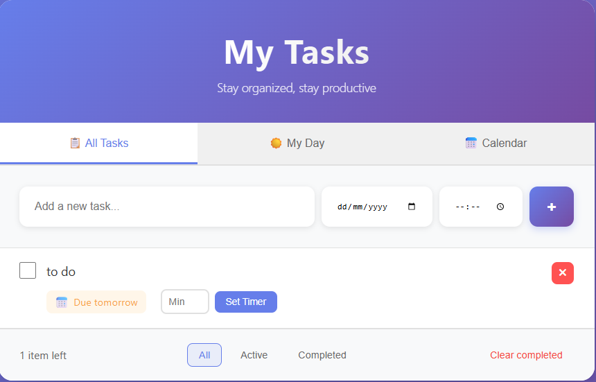
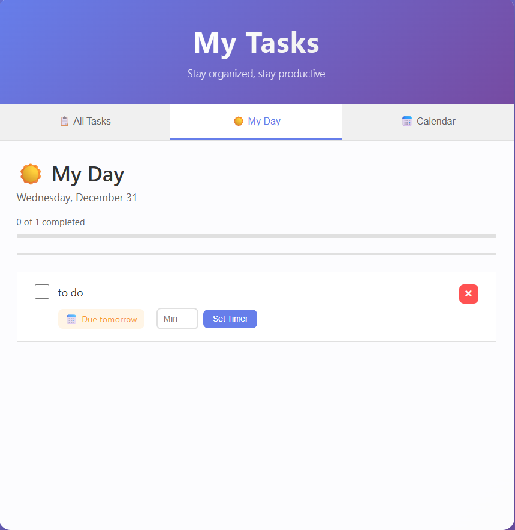
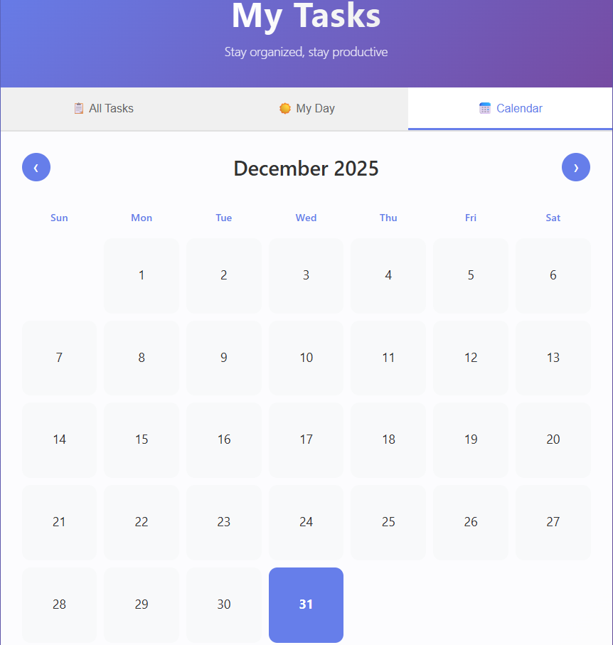

 Modern React To-Do (with Countdown Timers, Calendar, and My Day)

 
 
 

This is a modern, stylish to-do app built on Create React App. It adds countdown timers, due dates/times, a calendar view, and a focused My Day experience. Tasks persist in local storage.

 Features
- Countdown timers per task (set minutes, start/pause, reset; finished state blinks)
- Due date with optional time; smart phrasing like “Due today” or “Due tomorrow at 3:30 PM”
- Views: All Tasks, My Day (today’s tasks + progress), Calendar (monthly with day indicators)
- Filters for all/active/completed, clear completed, inline edit on double-click
- Local storage persistence so tasks survive reloads

 Getting Started
1. Install dependencies:
	- `npm install`
2. Start the dev server:
	- `npm start`
	- If port 3000 is busy, CRA will prompt to use 3001 (URL will print in the console).

 Usage
- Add task: enter title, pick a date, optionally pick a time, then click +
- Set countdown: enter minutes in the task’s timer box → Set Timer → play ▶
- My Day: shows tasks due today with a completion progress bar
- Calendar: see which days have tasks, click a day to view its tasks
- Filters: All / Active / Completed; clear completed to clean up

 Scripts
- `npm start` — run development server
- `npm run build` — production build to `build/`

 Tech
- React 18, Create React App
- CSS-only styling (no UI library)
